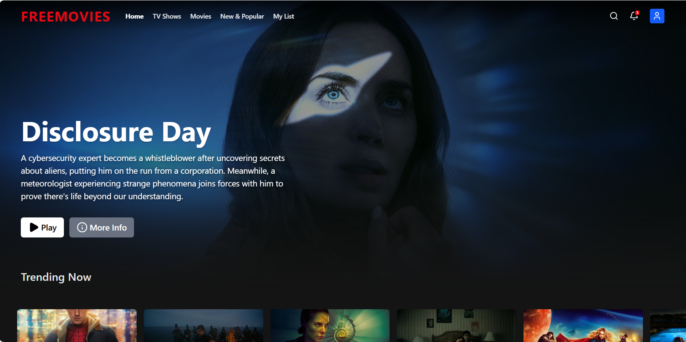

<div align="center">
  
  <h1>FreeMovies</h1>
  <p>A premium, high-performance streaming platform built with Next.js 15, Tailwind CSS, and Supabase.</p>
</div>

---

 


##  About The Project

FreeMovies is a full-stack, Netflix-inspired movie and TV show catalog application. It provides users with a stunning, dark-mode interface to discover trending media, watch trailers and full movies, and manage their own authenticated profiles.

##  Key Features

- **Premium UI/UX:** A responsive, dark-mode design with smooth micro-animations, glassmorphism, and a 3D animated welcome experience.
- **Real-Time Data:** Fetches live, up-to-date movie and TV show data directly from the TMDB API.
- **Secure Authentication:** Complete authentication system powered by Supabase, including secure JWT session management and edge middleware protection.
- **Custom Email System:** Official domain-verified email confirmations powered by Resend SMTP, featuring custom 3D HTML email templates.
- **Video Playback:** Integrated embedded video players for instant streaming.

##  Built With

- **Framework:** [Next.js 15](https://nextjs.org/) (App Router)
- **Styling:** [Tailwind CSS](https://tailwindcss.com/)
- **Database & Auth:** [Supabase](https://supabase.com/)
- **Email Delivery:** [Resend](https://resend.com/)
- **Deployment:** [Vercel](https://vercel.com/)
- **Icons:** [Lucide React](https://lucide.dev/)
- **API:** [TMDB (The Movie Database)](https://www.themoviedb.org/)

##  Getting Started

To get a local copy up and running, follow these steps.

### Prerequisites
Make sure you have Node.js installed on your machine.
- npm
  ```sh
  npm install npm@latest -g
  ```

### Installation

1. **Clone the repo**
   ```sh
   git clone https://github.com/WilWilbert123/FreeMovies.git
   ```
2. **Install NPM packages**
   ```sh
   cd FreeMovies
   npm install
   ```
3. **Set up Environment Variables**
   Create a `.env.local` file in the root directory and add your API keys:
   ```env
   NEXT_PUBLIC_TMDB_API_KEY=your_tmdb_api_key
   NEXT_PUBLIC_SUPABASE_URL=your_supabase_url
   NEXT_PUBLIC_SUPABASE_ANON_KEY=your_supabase_anon_key
   ```
4. **Run the Development Server**
   ```sh
   npm run dev
   ```
5. **Open the app**
   Visit `http://localhost:3000` in your browser.

##  Security

This project utilizes Next.js Edge Middleware to protect routes and verify active Supabase sessions on every request, preventing ghost sessions for deleted users. 

##  Author

**John Wilbert Gamis**
- GitHub: [@WilWilbert123](https://github.com/WilWilbert123)

---
*Created by John Wilbert Gamis &copy; 2026*
